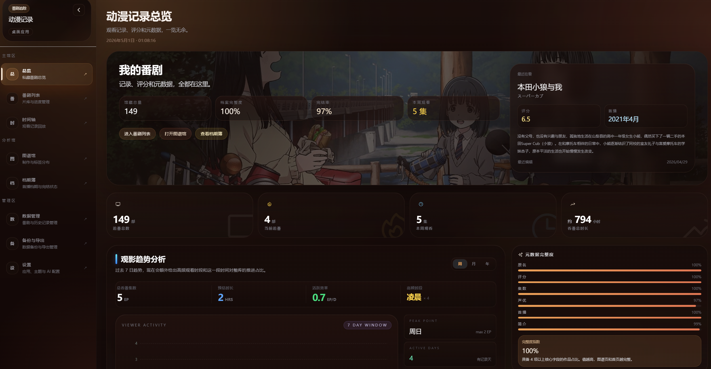
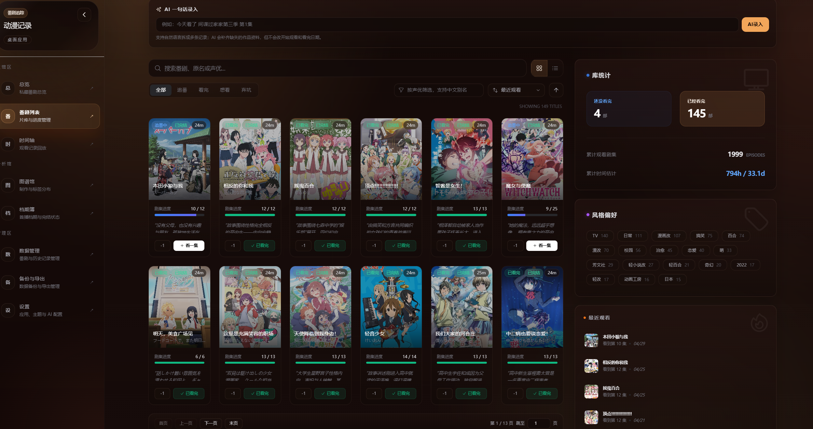
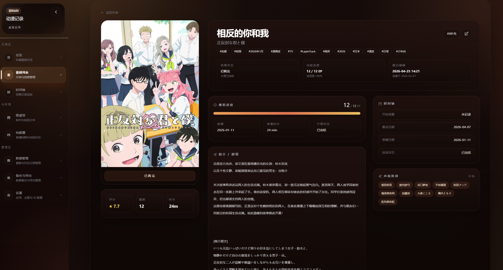
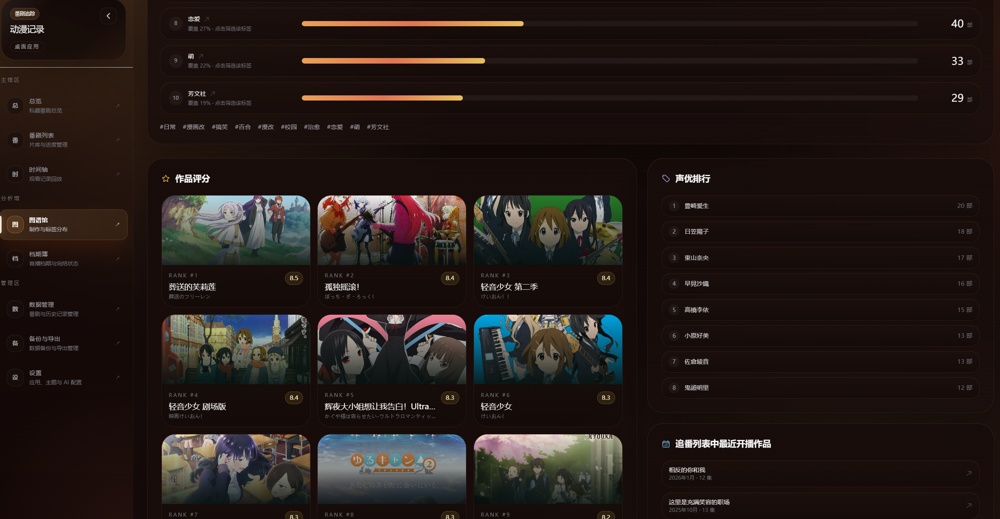
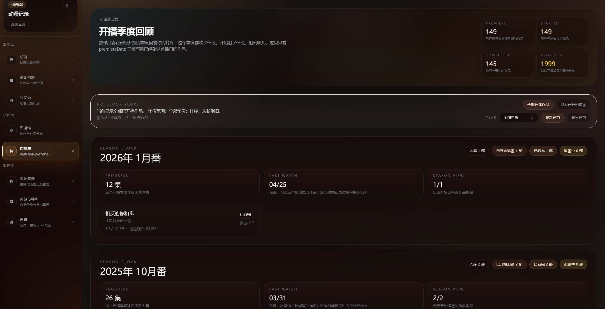
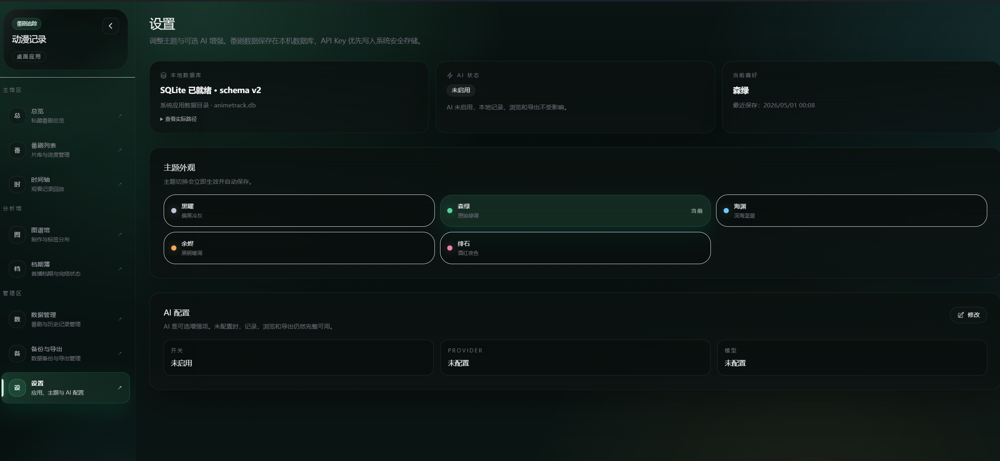
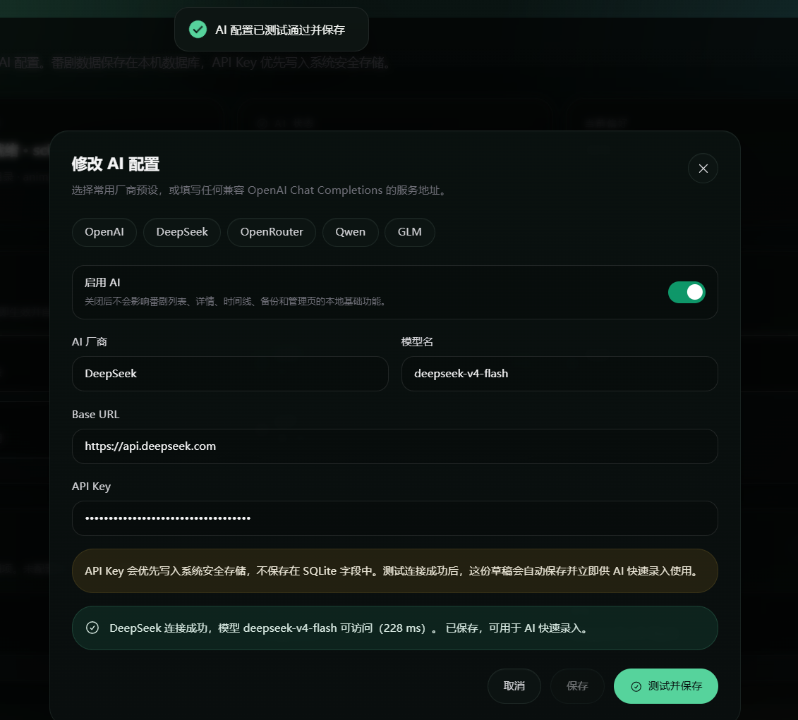
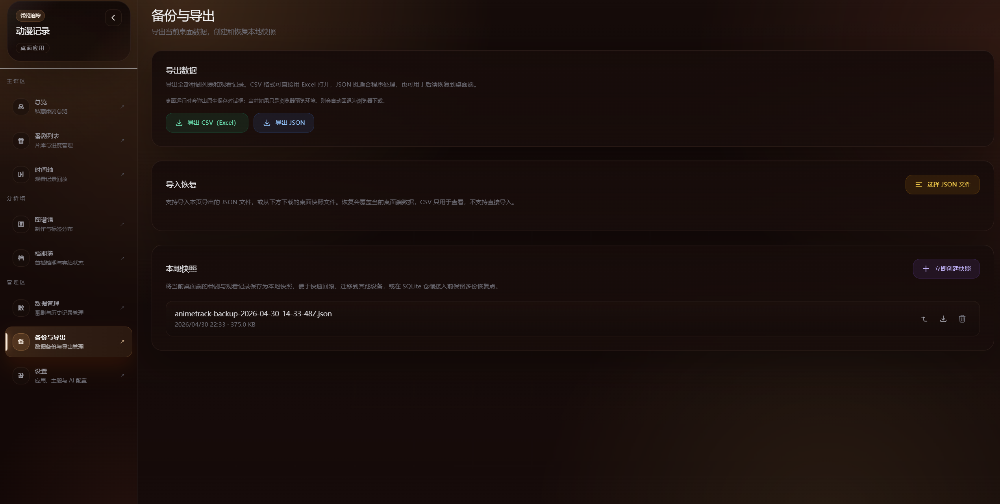
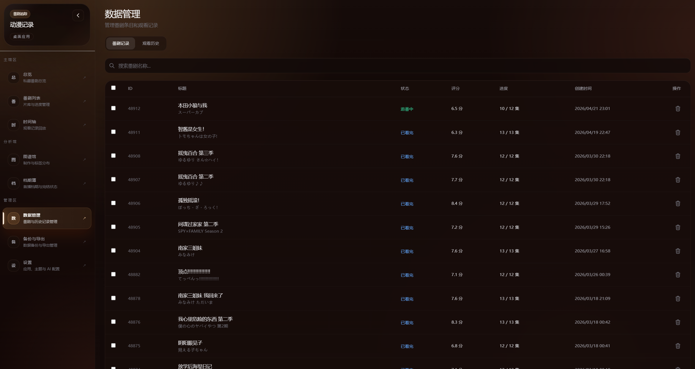

# AnimeTrack

AnimeTrack 是一个本地优先的桌面追番记录应用，用来整理你在看、看过、想看和补番过程中的各种信息。

它不需要你自己部署服务器，也不要求额外准备数据库服务。当前版本会把数据保存在本机，主要适合一个人长期记录自己的番剧片单、观看进度、时间线和一些补充资料。

## 这个应用能做什么

- 记录番剧条目、状态、进度、评分、标签和备注
- 查看最近观看历史和时间线
- 浏览作品图谱和季度回顾
- 导出 JSON、CSV，做本地快照和恢复
- 可选接入 AI，做一句话快速录入和元数据补充
- 用桌面端本地仓储保存数据，不依赖线上账号系统

## 怎么使用

你只需要下载发布包，然后二选一：

1. 安装版：运行安装包后直接打开 AnimeTrack
2. 便携版：解压 ZIP 后运行其中的 AnimeTrack.exe

说明：

- 这是桌面应用，不需要额外部署
- 当前数据默认保存在本机应用数据目录
- AI 功能不是必需项，不配置也可以正常使用绝大部分页面

## 页面介绍

### 1. 首页概览

这里会汇总你的追番总数、最近活动、近期重点作品和一些统计信息，适合当作日常打开后的总览页。

### 2. 番剧列表

这里是最核心的片单页面，可以筛选、搜索、分页浏览，也可以手动添加条目或用一句话快速录入。

### 3. 番剧详情

每部作品都有独立详情页，可以看进度、基础信息、备注、观看历史，也可以补充封面和元数据。

### 4. 时间线

时间线页面会把你的观看记录按时间整理出来，方便回看最近看了什么、什么时候补到哪一集。

### 5. 作品元数据图谱

这个页面更偏分析视图，会从你当前的片单里整理出标签、评分、声优和集数等维度的统计。

### 6. 开播季度回顾

这里会按照季度回看你的追番分布，适合看自己在哪些档期看得更多、记录得更完整。

### 7. 设置

设置页可以修改应用显示名称、主题和 AI 配置。AI 关闭时，不影响本地基础功能使用。

### 8. 备份与导出

这里可以做 JSON、CSV 导出，本地快照备份，以及导入恢复，适合迁移电脑或定期留档。

### 9. 数据管理

这个页面更适合集中检查条目和观看记录，做搜索、分页和批量清理。

## 仓库说明

如果你只是想了解仓库大概结构、页面对应文件和功能模块，可以继续看 项目结构与功能说明.md。
